# Swiggy Frontend Project using Angular

## Overview

This project is a frontend clone of the Swiggy application, built using Angular and styled with TailwindCSS. The application includes features such as user authentication, menu browsing, and cart management. The project demonstrates the use of Angular's routing, services, and guards to create a seamless user experience.

## Technologies Used

- **Angular**: A platform for building mobile and desktop web applications.
- **TailwindCSS**: A utility-first CSS framework for rapid UI development.
- **DaisyUI**: A plugin for TailwindCSS that provides a set of accessible and customizable UI components.

## Folder Structure and Components

### Folder Structure

The project follows a standard Angular folder structure:

- **src/**: Contains the source code of the application.
    - **app/**: Contains the main application module and components.
        - **auth/**: Contains components related to authentication (login, signup).
        

### Components

- **AppComponent**: The root component that bootstraps the application.
- **HeaderComponent**: Displays the header/navigation bar.
- **FooterComponent**: Displays the footer.
- **LoginComponent**: Handles user login.
- **SignupComponent**: Handles user registration.
- **HomeComponent**: Displays the homepage with popular cuisines and restaurants.
- **MenuComponent**: Displays the menu items for a selected restaurant.
- **CartComponent**: Manages the user's cart.
- **FavoritesComponent**: Displays the user's favorite items.

Each component is designed to be modular and reusable, following Angular's best practices.

## Proofs

Here are some screenshots of the application:

### Signup Page
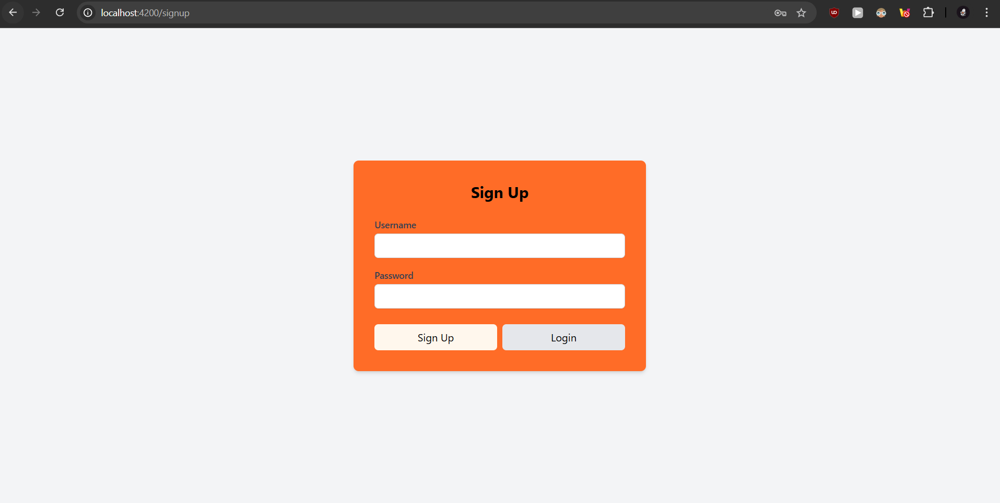
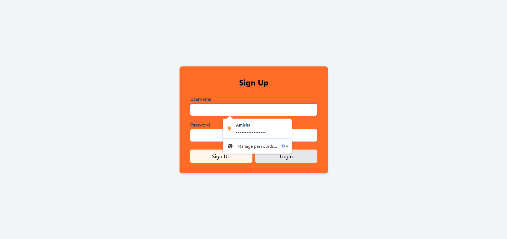
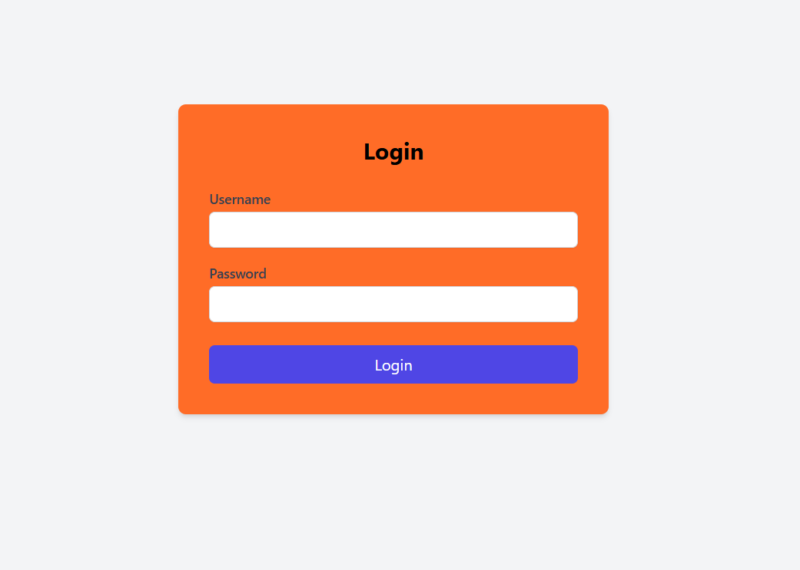
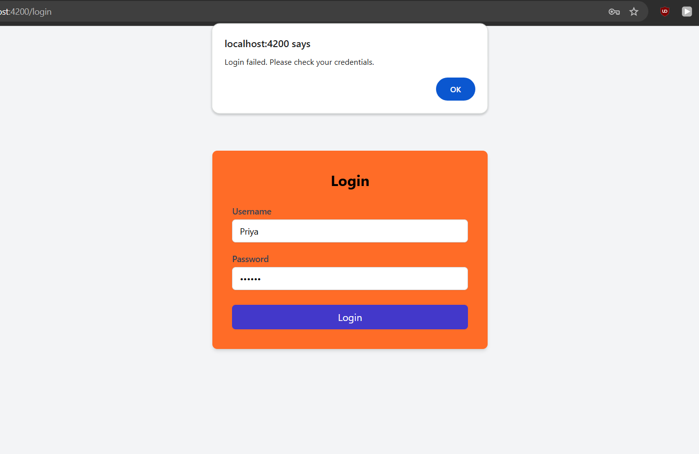

### Home Page
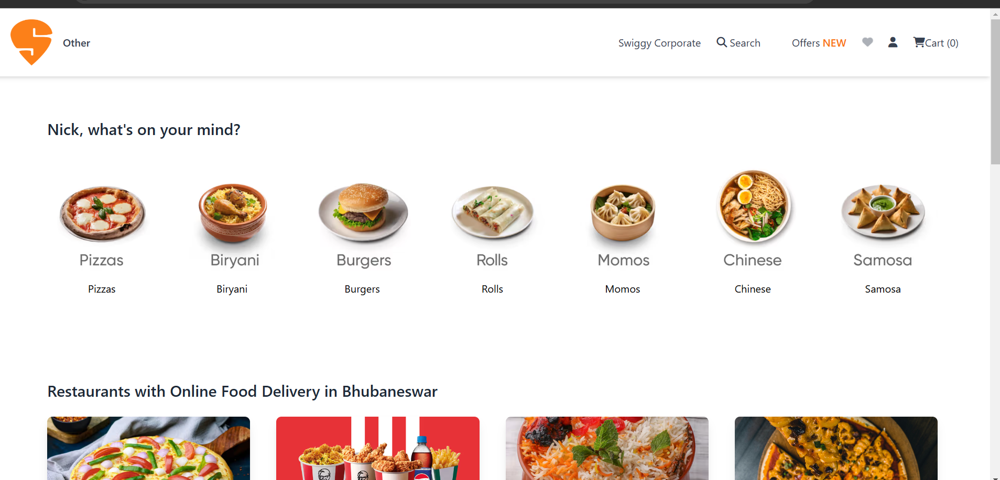
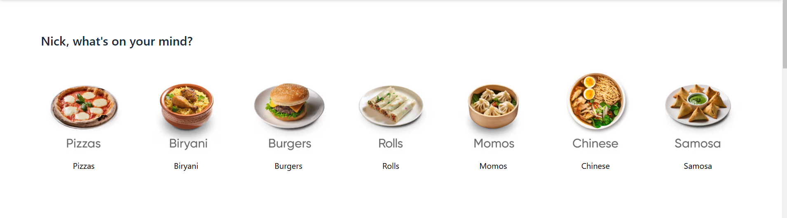
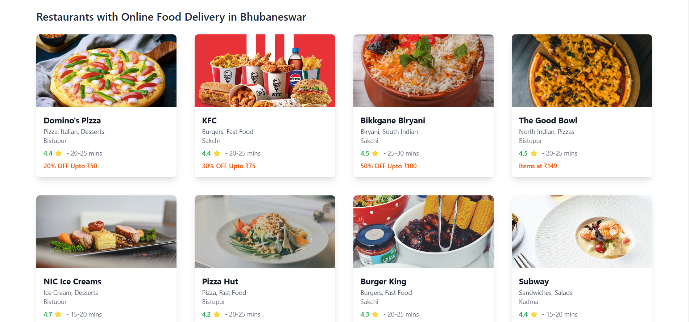
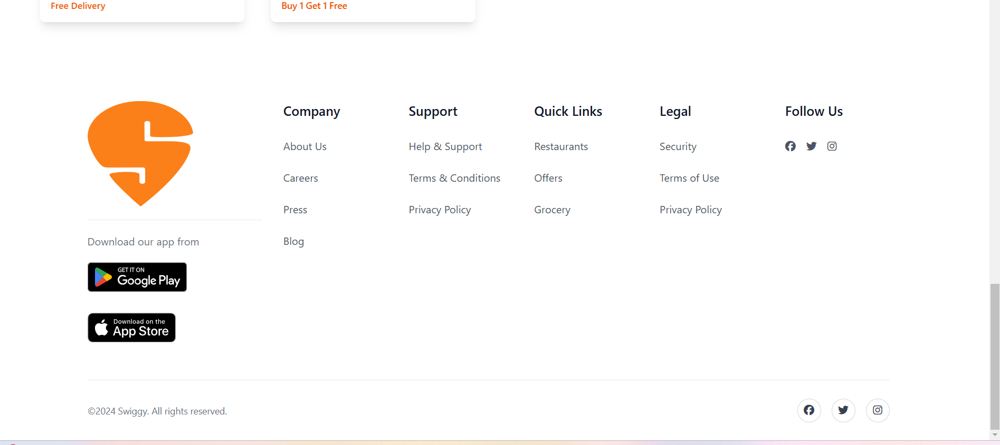
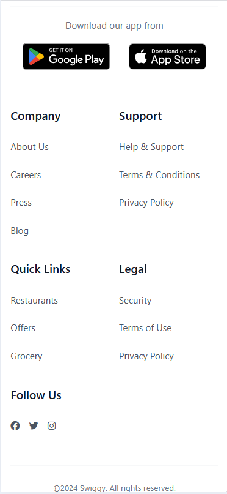

### Menu Page
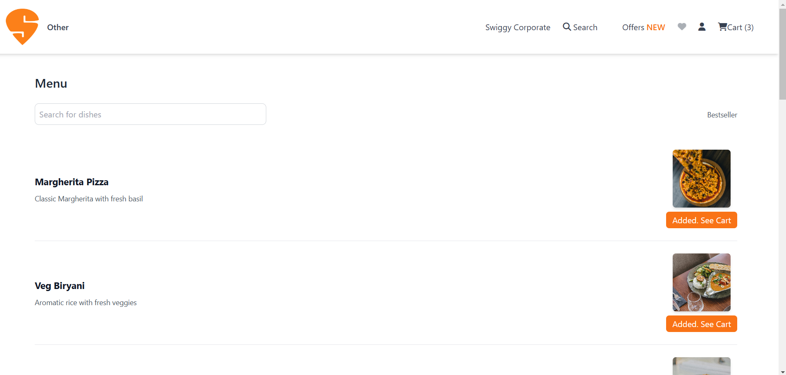
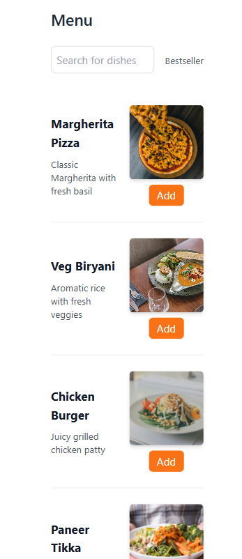

### Cart Page
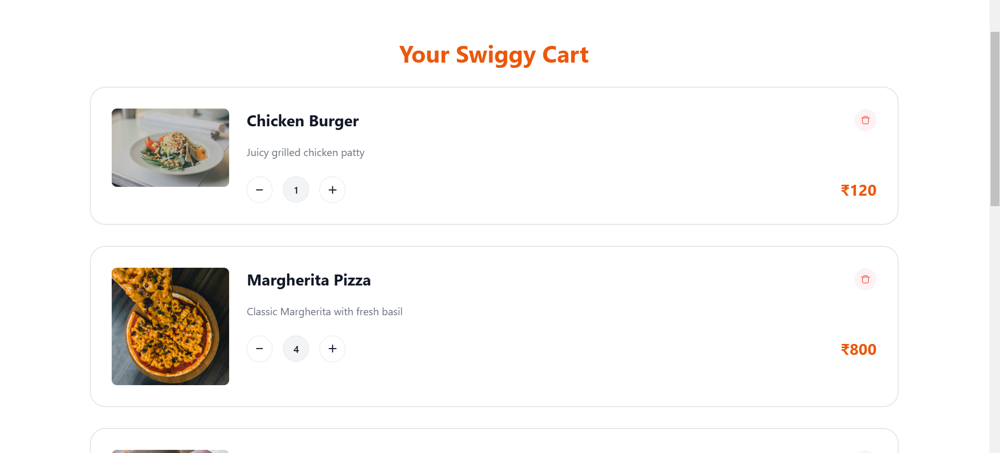
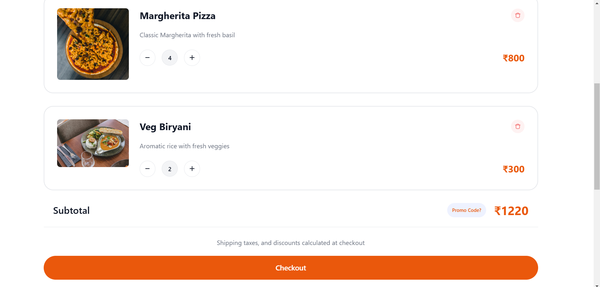

### Favorites Page
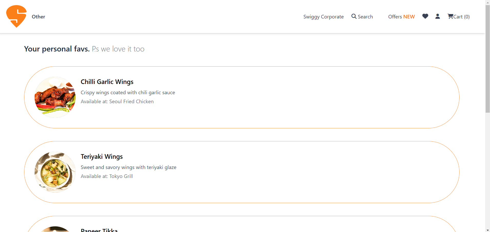
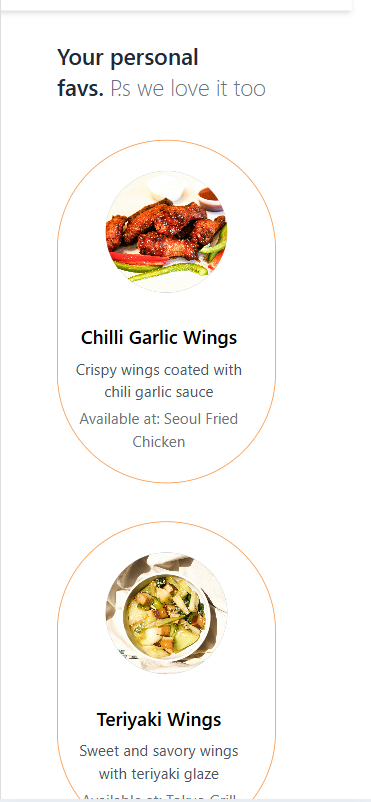

### Mockapi resources
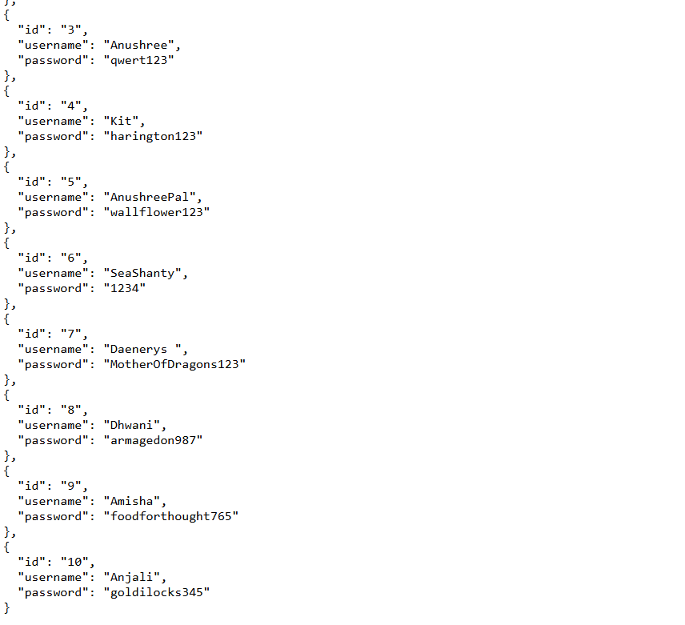

## Lessons Learned

### AuthGuard

I learned how to use Angular's `AuthGuard` to protect routes and ensure that only authenticated users can access certain parts of the application. This involved creating a guard service that checks the user's authentication status and redirects them to the signup page if they are not authenticated.

### Active Route for Separation of Auth Layout and Main Layout

I learned how to use Angular's routing to separate the authentication layout from the main layout. This involved creating different components for the header and footer and conditionally displaying them based on the current route. This ensures that the header and footer are not displayed on the login and signup pages.

## Acknowledgements

I would like to express my gratitude to:

- **Elan Sir**: For his guidance and support through the sessions.
- **Gopi Sir**: For his doubt clearing efforts.

## Development Server

Run `ng serve` for a dev server. Navigate to `http://localhost:4200/`. The application will automatically reload if you change any of the source files.

## Build

Run `ng build` to build the project. The build artifacts will be stored in the `dist/` directory.

## Running Unit Tests

Run `ng test` to execute the unit tests via [Karma](https://karma-runner.github.io).

## Running End-to-End Tests

Run `ng e2e` to execute the end-to-end tests via a platform of your choice. To use this command, you need to first add a package that implements end-to-end testing capabilities.